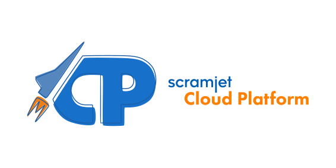

# Scramjet - Transform as a Service

Welcome to Scramjet's GitHub page!

We are a deep-tech company with a mission of delivering technology to improve the life of developers by allowing them to write fewer lines of code and be more effective in handling data. We want to let developers connect programs, not environments.

# Scramjet Cloud Platform

Scramjet Cloud Platforms brings clouds and local infrastructures together with simplicity at its core. It is a distributed data processing platform that allows you to deploy and run your programs in a serverless manner. It allows customers to run programs simultaneously in multiple languages, and interconnect multiple environments in ubiquitous data spaces, where programs can share the data and expose it through a single, globally available API.

Features:

- write and deploy simple long-running data processing programs called Sequences,
- use the platform console panel to interact with your Sequences,
- invoke Sequences programmatically via CLI or API or a set of client libraries,
- monitor and control running Sequences via one central, publicly available, secure API,
- send and receive data produces and required by running Sequences,
- share data between multiple Sequences by enclosing them in virtual Data Spaces,
- connect self-hosted servers to existing Data Spaces with minimum configuration,
- create execution environments at multiple cloud providers with a click of a button.
- low memory footprint compared to, over 20 times lower memory usage than the Kafka/Flink stack

Use cases:

Scramjet Cloud Platform can become handy in any use case involving streaming data from one source to another, it can handle many types of inputs (basically any input that can be handled by Node.js application such as Text, JSON, XML, SOAP, Audio, Video and more). In the Sequence, you can perform any operation on the data with your code. Scramjet Cloud Platform exposes its REST API to provide and receive data and manage Sequences, Instances and itself. Lastly, our engine outputs can be managed in several ways - you can output to a local or remote file, STDOUT and STDERR output systems are supported, outputs can be consumed from our REST API, you can request URL / webhook, or stream the output to a destination of your choosing - or a mix of the above!

Samples:

We have several ready-to-use samples prepared in Python, JavaScript and TypeScript - you can check them all out in our documentation here: https://docs.scramjet.org/platform/samples.

# Scramjet Transform Hub

Scramjet Transform Hub is the open-source core of the Scramjet Cloud Platform. It allows customers to start the execution part of the platform in any environment, on any system, on-premises or at any cloud or infrastructure provider. Our customers can install STH (Scramjet Transform Hub) on any POSIX-compatible system and access their data from any location, using private APIs or deploy a whole solution deep behind firewalls, leveraging your available computing resources.

The main repository for Scramjet Transform Hub is [scramjetorg/transform-hub](https://github.com/scramjetorg/transform-hub).

You can also find Scramjet Transform Hub packages on NPM: [npmjs.com/package/@scramjet/sth](https://www.npmjs.com/package/@scramjet/sth) and [npmjs.com/package/@scramjet/cli](https://www.npmjs.com/package/@scramjet/cli).

# Scramjet Framework

Fast, simple, functional reactive stream programming framework written on top of node.js object streams. The code is written by chaining functions that transform the streamed data, including the well-known map, filter and reduce and is fully compatible with ES7 async/await. Thanks to it some built-in optimizations scramjet is much faster and much simpler than similar frameworks when using asynchronous operations.

The main repository for the Scramjet framework is [scramjetorg/framework-v4](https://github.com/scramjetorg/framework-v4).

You can also find the Scramjet Framework package on NPM [npmjs.com/package/scramjet](https://www.npmjs.com/package/scramjet)

# More about us

- Our Website: [Scramjet.org](https://scramjet.org)
- LinkedIn profile: [Scramjet LinkedIn](https://linkedin.com/company/scramjet)
- Our discord server: [Scramjet's Discord](https://scr.je/ddoc)

